# Predicting Glycemic Control in Type 2 Diabetes Patients on GLP-1 Receptor Agonists

## 📑 Table of Contents
- [Overview](#-overview)
- [Objective](#-objective)  
- [Methods](#️-methods)
- [Data & Cohort](#-data-&-cohort)
- [Key Findings](#-key-findings)
- [Exploratory Data Analysis](#-exploratory-data-analysis)
- [Model Evaluation](#️-model-evaluation)
- [Patient Subgroup Analysis](#-patient-subgroup-analysis)
- [Limitations](#️-limitations)

## 📖 Overview

- Type 2 diabetes is one of the most common chronic diseases worldwide. The American Diabetes Association recommends that patients manage their diabetes by maintaining A1C levels below 7%[^1]
- GLP-1 receptor agonists (GLP-1 RA) are an effective class of glucose-regulating medications used to manage diabetes, but not all patients achieve glycemic control while taking them. For example, Peng et al. (2020) found that less than 25% of diabetes patients achieved A1C levels below 7% after taking GLP-1 RAs if their baseline A1C levels were above 9%[^2]
- Treatment outcomes vary according to patient characteristics like baseline A1C severity, patient demographics, and the presence of diabetes-related complications

## 🎯 Objective

The goal of this project is to develop supervised classification models to answer the following questions

1. Which **characteristics** best predict whether a patient on GLP-1 RA medications will achieve glycemic control?
2. Which **patient subgroups** are most likely to achieve glycemic control?

## 🛠️ Methods

- **Python Libraries**: `pandas`, `numpy`, `matplotlib`, `seaborn`, `scikit-learn`, `tableone`

- **Feature Engineering**: Continuous baseline A1C levels were binned into severity categories (`baseline_category`) 7-8%, 8-9%, and ≥9% for greater interpretability. Patients without a recorded baseline A1C measurement were assigned to an "unknown" category rather than excluded. Diabetes-related complications (kidney disease, ketoacidosis, hypertension, etc.) and concomitant prescriptions (insulin, metformin) were originally recorded as timestamps indicating months relative to treatment initiation. They were converted to binary presence/absence indicators[^3]. The binary outcome label glycemic_control was created by dichotomizing based on whether an A1C value was below 7%

- **Data Preprocessing**: Nominal categorical features were encoded with `OneHotEncoder` and ordinal categorical features were encoded with `OrdinalEncoder`. Continuous features like `age` were not encoded.

- **Model Development**: Logistic regression was used as an interpretable baseline to compute odds ratios. A decision tree was included for its ability to capture non-linear relationships while remaining interpretable via visualization. A random forest model was included as a robust alternative to the decision tree model.

- **Training & Optimization:** An 80/20 train-test split with stratification was used to preserve the 60/40 class distribution in `glycemic_control` and reduce overfitting. Hyperparameter tuning via `GridSearchCV` with 5-fold stratified cross-validation was used to improve model performance.

- **Model Evaluation**: ROC-AUC, average precision, recall, F1 score, confusion matrices

- **Patient Subgroup Analysis**: Success rates across different subgroups were defined by baseline A1C severity, race, and GLP-1 RA medication type to identify patient populations that benefited the most from treatment. Subgroups with less than 20 patients were excluded from analysis.

## 📈 Data & Cohort

- **Data Source:** The data were obtained from MDClone, a healthcare software platform that generates synthetic data from real-world electronic health records. The synthetic data in this project is based on EHR data from the UChicago Medical Center. It includes patients who were on medications like semaglutide, tirzepatide, or liraglutide to manage their type 2 diabetes. Features were queried from MDClone using ICD-10 diagnostic codes, lab results, and outpatient prescription records. NOTE: The data is not available for download in this project to protect patient privacy.

- **Cohort**: Patients were included in the analysis if they were 18 years or older, had uncontrolled diabetes (A1C ≥ 7%), and had been prescribed GLP-1 RA medication. Patients were excluded if they were hypoglycemic or had type 1 diabetes. 

- Features: `sex`, `race`, `age`, `glp_medication`, `has_kidney_disease`, `has_ketoacidosis`, `has_hyperglycemia`, `has_other_specified`, `has_circulatory`, `metformin_use`, `insulin_use`, `has_hypertension`, `baseline_category`

- **Outcome**: A patient's treatment was considered successful if they had achieved `glycemic_control`, defined as a post-treatment A1C level below 7%

## 💡 Key Findings

1. **Exploratory analysis revealed that the selected cohort (n=3,272) was had severe, uncontrolled diabetes**. Patients were mostly middle-aged to older with high baseline A1C levels (mean 9.25% / median 8.80%) and diabetes-related complications like hypertension.

2. **The majority of patients did not achieve glycemic control** but did see improvements in their A1C levels. The post-treatment A1C mean was 7.7%

3. **Most patients did not achieve glycemic control**, but the cohort did experience a substantial reduction in A1C overall (mean baseline level of 9.26% to post-treatment level of 7.70%, a 1.56% reduction). This demonstrates that patients benefit from GLP-1 RA therapy even if they do not necessarily reach their glycemic target.

4. **Baseline A1C is the strongest predictor** of treatment success, with patients starting above 9% significantly less likely to achieve glycemic control

5. **Patients on tirzepatide were more likely to achieve glycemic control** compared to patients on semaglutide. Patients on liraglutide made up the majority of unsuccessful treatment outcomes. 

6. **Racial disparities in treatment outcomes exist** with White patients showing higher rates of glycemic control compared to Black patients (who comprise 57% of the cohort). Even when prescribed the same medications at the same baseline A1C levels, Black patients achieve lower success rates compared to White patients. This suggests that outcome disparities are not driven by health factors alone, but may reflect differences in social determinants of health, healthcare engagement, or other systemic factors not captured in the data.

7. **GLP-1 RA medication can mitigate the effects of severe baseline A1C levels** but are more effective at lower levels. Black and White patients achieved glycemic control at higher rates on tirzepatide and semaglutide compared to liraglutide across all baseline A1C categories, despite outcome disparities.

These results suggest that clinicians should consider earlier interventions for more at-risk groups (e.g. high baseline A1C, Black patients, older patients) and prescribe newer GLP-1 RA medications such as tirzepatide and semaglutide to increase the likelihood of achieving glycemic control

# 📊 Exploratory Data Analysis

## Baseline Patient Characteristics

  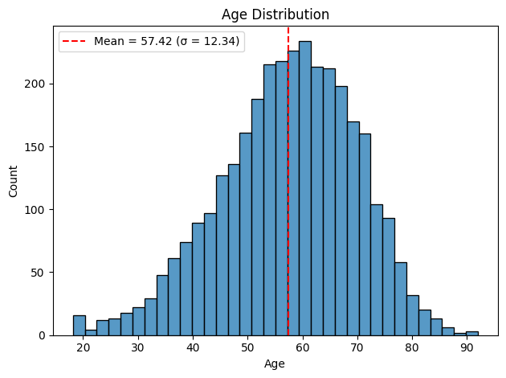

- **The cohort primarily consisted of middle-aged to older adults** whose mean age was 57 years (SD 12.3). This population likely requires long-term diabetes management and monitoring for other age-related diseases. 

  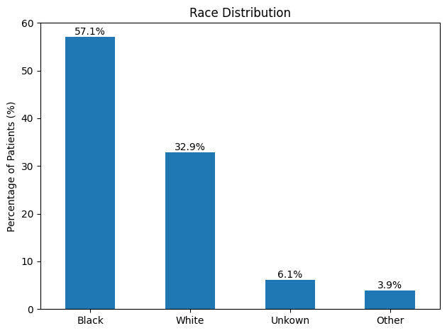

- **The majority of patients in the cohort identified as Black (57%).** This is higher than the national average and reflects the community that the UChicago Medical Center predominantly serves.

  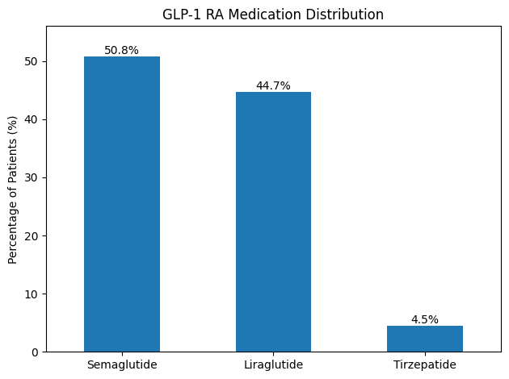

- **Semaglutide (51%) and liraglutide (45%) were the most prescribed GLP-1 RAs**, while only a few patients used tirzepatide (5%). Semaglutide's higher usage compared to liraglutide might reflect its superior efficacy.

  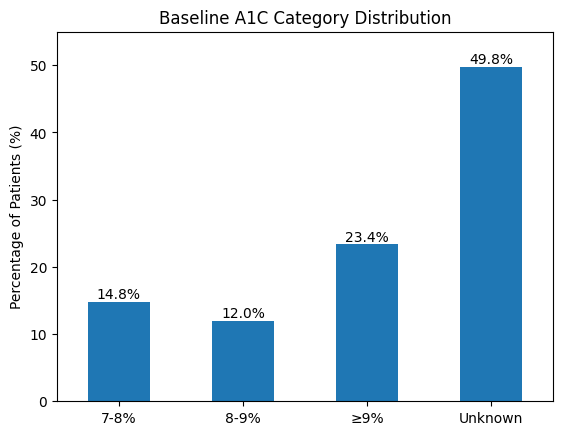
  &nbsp;&nbsp;&nbsp;&nbsp;
  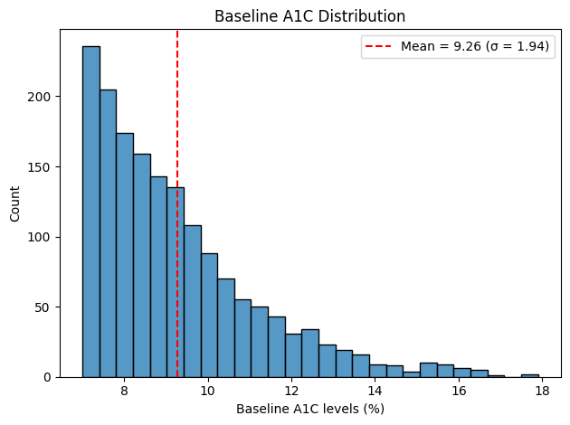

- **The cohort had severe, uncontrolled diabetes.** Half of patients lacked baseline measurements. Among those with documented baselines, the majority had a baseline ≥9% with mean 9.26% (SD 1.94) and median 8.80% (not shown). This suggests that GLP-1 RA therapy was likely initiated after substantial disease progression.

  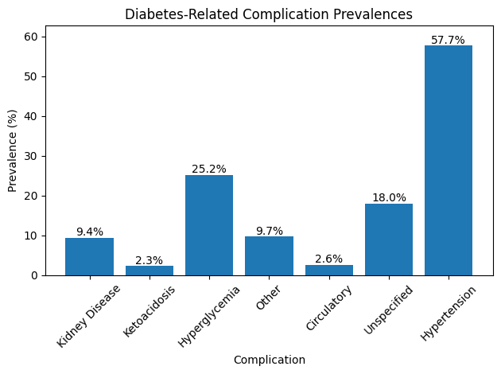

- **The prevalence of diabetes-related complications was moderately high in the cohort**, with hypertension being the most prevalent (57%)

## Treatment Outcomes

  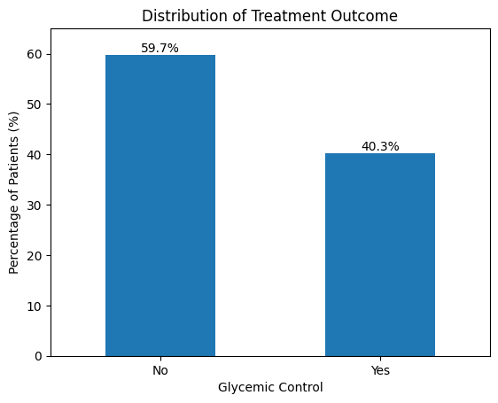

- **Most patients (60%) did not achieve the A1C <7% target following GLP-1 RA therapy.** 

  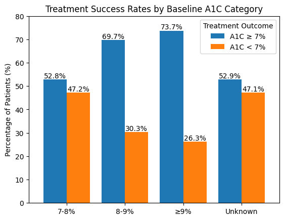

- **Patients with higher baseline A1C had progressively worse treatment outcomes.** Patients with a baseline ≥9% had nearly half the success rate (26%) of those with a baseline within 7-8% (47%). Notably, patients with an unknown baseline had success rates comparable to patients with mild baseline levels, supporting the earlier finding that patients with an unknown baseline likely belong to a lower-risk population. 

  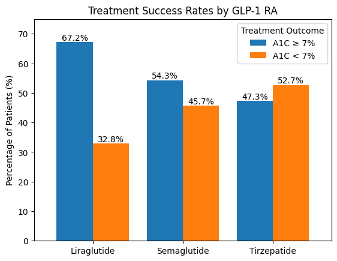

- **Patients on tirzepatide were more likely to achieve glycemic control compared to patients on the other medications.** The least effective GLP-1 receptor agonist was liraglutide, on which only 32% of patients were able to reach their glycemic target. 

  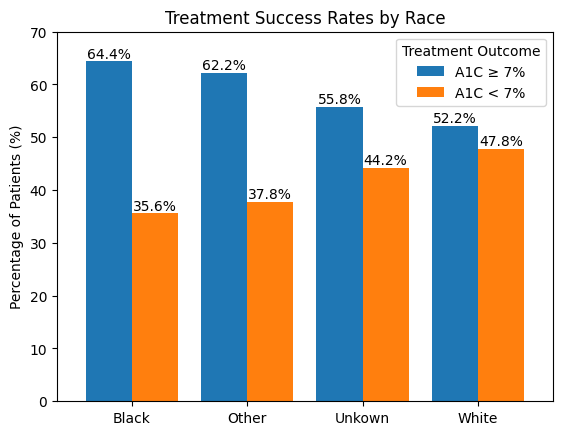

- **Significant racial disparities exist in treatment outcomes.** The success rate for Black patients is nearly 12% less than the success rates of White patients.

# ⭐️ Model Evaluation

- Baseline models were created with default parameters as a performance benchmark. 

## Baseline Performance

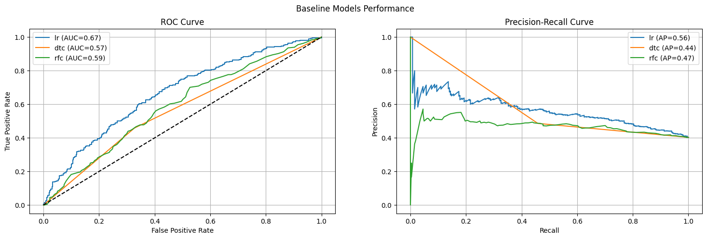

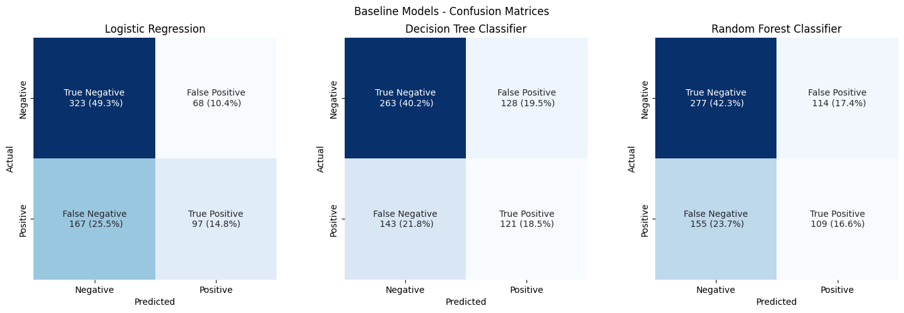

| Model | ROC-AUC | PR-AP | Accuracy | Precision | Recall | F1 |
|---|---|---|---|---|---|---|
| Logistic Regression | 0.67 | 0.56 | 0.64 | 0.59 | 0.37 | 0.45 |
| Decision Tree Classifier | 0.57 | 0.44 | 0.59 | 0.49 | 0.46 | 0.47 |
| Random Forest Classifier | 0.59 | 0.47 | 0.59 | 0.49 | 0.41 | 0.45 |

## Optimized Performance (Hyperparameter Tuning)

- All models achieved similar modest performance (ROC-AUC 0.67-0.68), suggesting 
data limitations rather than model choice as the primary constraint. The random forest classifier's performance improved for precision (0.49 -> 0.59) but declined drastically for recall (0.41 -> 0.24) and F1 score (0.45 -> 0.34). Both the logistic regression model and decision tree classifier's performance improved for recall and F1 score.

The decision tree classifier's accuracy improved 

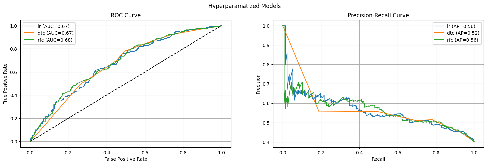

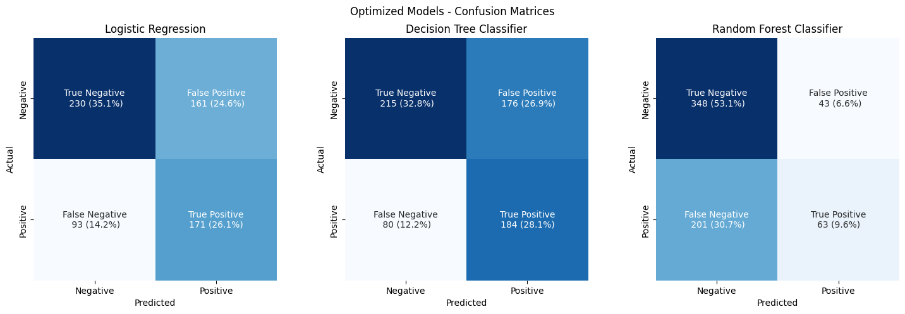

| Model | ROC-AUC | PR-AP | Accuracy | Precision | Recall | F1 |
|---|---|---|---|---|---|---|
| Logistic Regression | 0.67 | 0.56 | 0.61 | 0.52 | 0.65 | 0.57 |
| Decision Tree Classifier | 0.67 | 0.52 | 0.61 | 0.51 | 0.70 | 0.59 |
| Random Forest Classifier | 0.68 | 0.56 | 0.63 | 0.59 | 0.24 | 0.34 |

### Feature Importances

- Baseline A1C category, race, and GLP-1 medication type were the strongest predictors across all models. For example, according to the logistic regression model, each one-category increase in baseline A1C reduced odds of success by 23% (OR=0.77), White racial identification was associated with 34% higher odds (OR=1.34), and liraglutide showed 35% lower odds (OR=0.65) compared to tirzepatide (OR=1.07). These findings validate the patterns observed in exploratory analysis.

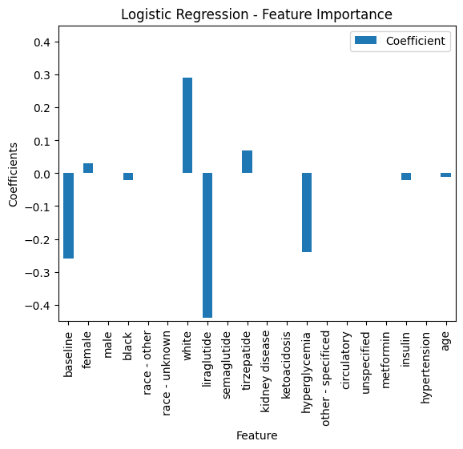

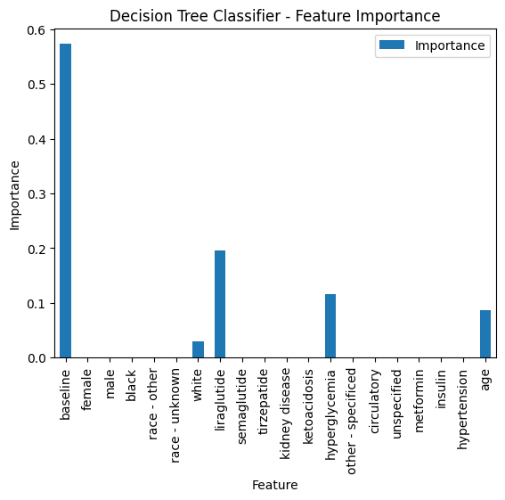

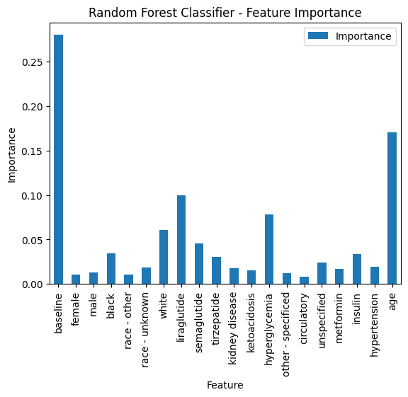

# 🔍 Patient Subgroup Analysis

- **Disease severity overshadows other factors.** Patients within the same racial group and using the same medication saw higher success rates if their baseline was 8-9% than if their baseline was ≥9%

- **Liraglutide consistently underperforms across all severity levels and racial groups.** Liraglutide shows 20-25% success rates compared to 30-45% for semaglutide in similar subgroups. There is 9-13% difference between the success rates semaglutide and liraglutide overall.

- **Racial Disparities Persist Across All Medications.**. Even when prescribed the same medication at the same disease severity, Black patients achieve lower success rates:

**High Severity (Baseline A1C ≥9%)**

| Medication | Overall Success Rate (Any Race) | Black Patients | White Patients |
|---|---|---|---|
| Tirzepatide | 34.3% (n=35) | 33.3% (n=24) | -- |
| Semaglutide | 31.1% (n=344) | 27.3% (n=216) | 41.7% (n=84) |
| Liraglutide | 21.2% (n=386) | 20.4% (n=274) | 25.6% (n=90) |

**Moderate Severity (Baseline A1C 8-9%):**

| Medication | Overall Success Rate (Any Race) | Black Patients | White Patients |
|---|---|---|---|
| Tirzepatide | -- | -- | -- |
| Semaglutide | 36.0% (n=200) | 31.4% (n=102) | 45.6% (n=68) |
| Liraglutide | 22.5% (n=178) | 21.1% (n=109) | 24.5% (n=49) |

**Mild Severity (Baseline A1C 7-8%):**

| Patient Group | Overall Success Rate|
|---|---|
| Overall | 47.2% (n=485) |
| White patients | 49.7% (n=175) |
| Black patients | 44.8% (n=259) |

## Decision Tree Subgroups

- **Root split (baseline A1C):** Separates healthier (unknown/7-8%) from sicker (8-9%/≥9%) patients
- **Secondary splits (liraglutide):** Both branches split on liraglutide, confirming its 
consistent negative association with outcomes across all severity levels
- **Tertiary splits (age, race):** Age and race effects appear after accounting for baseline 
and medication

  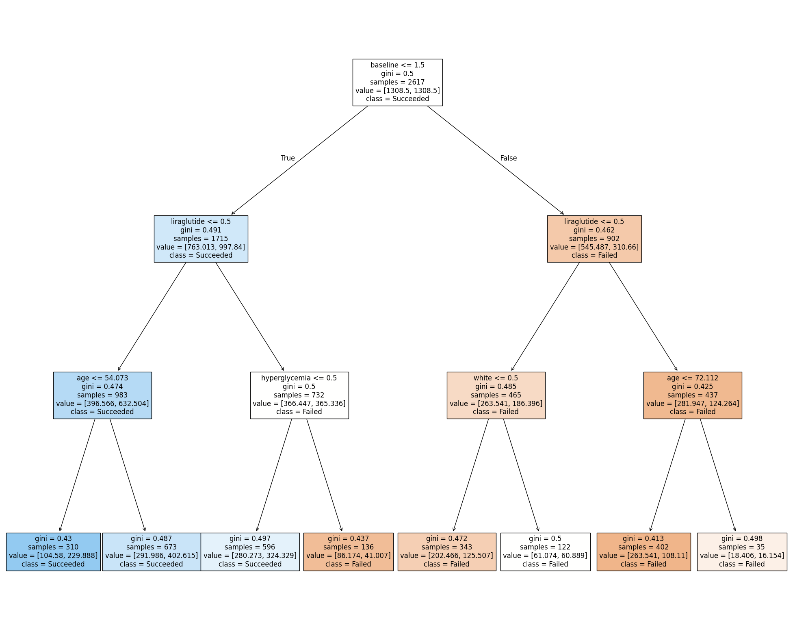

# ⚠️ Limitations

- **Narrow Definition of Success**: Most patients who don't reach glycemic control still experience meaningful A1C reductions. For example, a patient with a baseline A1C of 9.5% who achieves a post-treatment A1C of 7.8% has "failed" by my definition of treatment success. Setting glycemic control as the success metric aligns with ADA guidelines but most clinicians in healthcare settings would probably consider any substantial reduction in A1C level a success. 

- **Selection Bias**: Of 11,796 eligible patients, only 27% (n=3272) of patients had a recorded post-treatment A1C level. Patients with an A1C measurement differed significantly from those without one. The prevalence of diabetes-related complications was lower among patients missing a measurement (n=8524). This suggests that the patients examined in this project were generally sicker compared to patients excluded from it. Results from this project may not generalize to healthier patients.

- **Misrepresentative Sample:** Black patients were overrepresented among patients with a recorded post-treatment A1C level (57% vs 49% in eligible population). Findings about racial disparities in treatment outcomes should be interpreted cautiously given the demographic imbalance.

- **Limited Features**: Other characteristics, like BMI and disease duration, are also predictive of glycemic control according to research literature but they were not available for use in the dataset. 

- **Modest Model Performance**: The classification models performed only modestly. The most predictive models had generally poor precision and recall scores. Future work could explore different approaches to improving these metrics (especially precision) like threshold tuning. It could also be the case that the features available do not capture enough variance to predict outcomes well.

[^1]: American Diabetes Association Professional Practice Committee; 6. Glycemic Goals and Hypoglycemia: Standards of Care in Diabetes—2025. Diabetes Care 1 January 2025; 48 (Supplement_1): S128–S145. https://doi.org/10.2337/dc25-S006

[^2]: Peng XV, McCrimmon RJ, Shepherd L, Boss A, Lubwama R, Dex T, Skolnik N, Ji L, Avogaro A, Blonde L. Glycemic Control Following GLP-1 RA or Basal Insulin Initiation in Real-World Practice: A Retrospective, Observational, Longitudinal Cohort Study. Diabetes Ther. 2020 Nov;11(11):2629-2645. doi: 10.1007/s13300-020-00905-y. Epub 2020 Sep 9. PMID: 32902774; PMCID: PMC7547934.

[^3]: For example, if `kidney_disease_months` = -1.7 (diagnosed 1.7 months before treatment), then `has_kidney_disease` = 1. NaN values indicate no documented diagnosis rather than missing data, since ICD-10 codes are only recorded when an event occurs.
